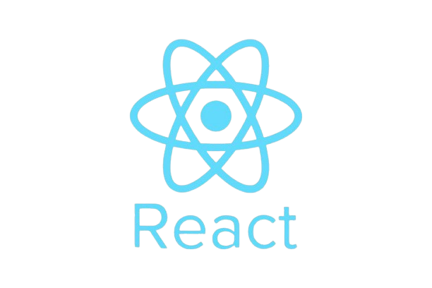

# 👨‍💻 Gustavo Bozzo

### Estudante de Tecnologia • Desenvolvimento Web • IA • Acessibilidade

---

# 🚀 Sobre mim

🎓 Graduando em Análise e Desenvolvimento de Sistemas  
💻 Focado em desenvolvimento web e programação com Python  
🧠 Interesse em IA, acessibilidade e experiências imersivas  
🌊 Criador de projetos voltados para inclusão e tecnologia  
📚 Atualmente estudando React.js, Banco de Dados e APIs  

---

# 🛠️ Tecnologias

---

# 📊 Estatísticas

  

---

# ⚙️ Atividade

---

# 🌐 Redes e Contato

