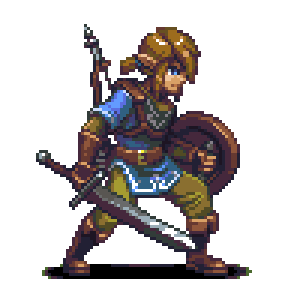
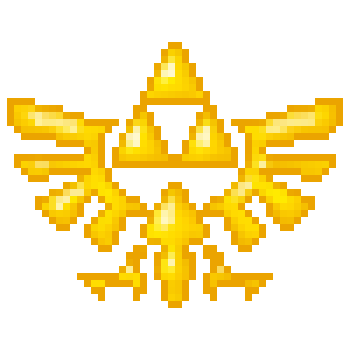

### Olá! Eu sou Gustavo Bozzo

Graduando em Análise e Desenvolvimento de Sistemas  
Desenvolvedor Full-Stack  
Formado no Instituto PROA em Desenvolvimento Web Java

### Contato

 

<h1> Tecnologias

### Front-End

### Back-End / Dados

### Ferramentas

# Atividades

<table>
<tr>
<td width="600">

</td>
<td align="center">

 
 
 
 

</td>
</tr>
</table>

